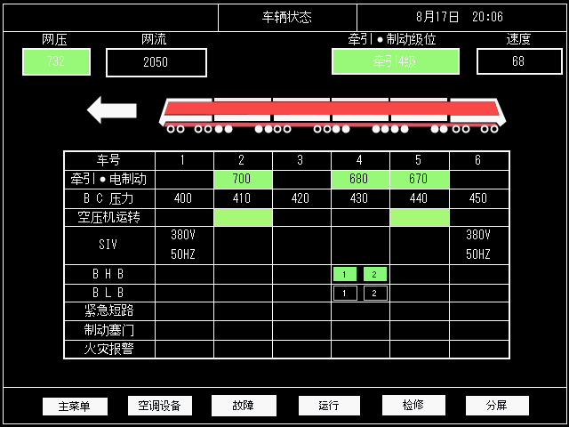
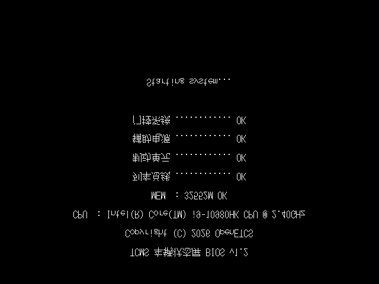
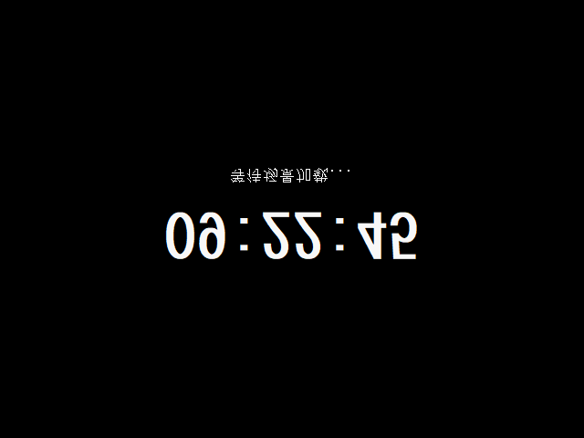
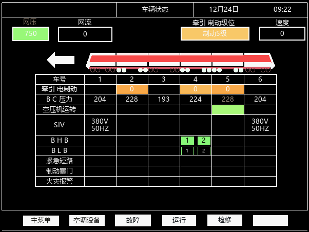

# TCMS 车辆状态屏

> 列车车辆状态屏（Train Control & Monitoring System）显示组件，C + Win32 GDI/GDI+ 实现，
> 内部 602x452 逻辑坐标，按目标尺寸等比放大呈现（默认 640x480，与驾驶台同尺寸）。
> 界面样式参考东洋（Toyo）TCMS 风格。
> 已实现界面：**运行界面 / DOS 启动屏 / 待机时钟屏**（后续页面开发中）。

## 功能

- 网压 / 网流 / 牵引·制动级位 / 速度 显示
- 6 节车厢状态：BC 制动缸压力、牵引/电制动、空压机、SIV、火灾报警
- BHB/BLB 指示灯、日期时间栏
- **启动流程**：DOS 自检屏（10 行逐行显示）→ 待机时钟屏 → 运行界面
- **车轮工况**：牵引/电制动时实心白，否则空心；切换时**相邻两轮一组随机错开**（0.5s 内全部完成）
- 底部菜单栏（主菜单/空调设备/故障/运行/检修/分屏·恢复）
- 任意目标尺寸等比缩放渲染（GDI+ 抗锯齿；空心圆=白盘+黑心挖孔，小尺寸圆滑）

## 界面截图

## 文件

| 文件 | 说明 |
|------|------|
| tcms_screen.h | 接口定义（TCMS_State + tcms_set_xxx + 渲染函数） |
| tcms_screen.c | 实现（Win32 GDI 绘制 602x452 界面，任意尺寸等比呈现） |
| gfx_gdiplus.cpp | GDI+ 抗锯齿渲染桥接（文字/多边形/圆） |
| main.c | 演示程序（定时器模拟数据，F2 存 BMP，Esc 退出） |
| make.bat | 一键编译（需要 MinGW gcc/g++ 在 PATH） |

## 编译

~~~bash
make.bat
# 或手动:
# gcc -O2 -mwindows main.c tcms_screen.c gfx_gdiplus.cpp -lgdiplus -o tcms_screen.exe
~~~

运行 main.c 演示：窗口内定时模拟数据；按 F2 保存 BMP；Esc 退出。

## 接入你自己的程序

1. 包含 tcms_screen.h
2. TCMS_State st; tcms_init(&st);
3. 数据源更新时调用接口：
   - tcms_set_net_voltage(&st, 网压)
   - tcms_set_net_current(&st, 网流)
   - tcms_set_traction_level(&st, 牵引级位)
   - tcms_set_brake_level(&st, 制动级位)
   - tcms_set_speed(&st, 速度)
   - tcms_set_datetime(&st, 日期, 时间)
   - tcms_set_traction_eb(&st, 车厢号, 0..3)  /* 0无 1牵引绿 2制动黄 3紧急红 */
   - tcms_set_emergency_brake(&st, 0/1)
   - tcms_set_bc_pressure(&st, 车厢号, kPa)
   - tcms_set_siv(&st, 车厢号, 0/1)
   - tcms_set_air_compressor(&st, 车厢号, 0/1)
   - tcms_set_fire_alarm(&st, 车厢号, 0/1)
   - tcms_set_bhb(&st, 0..1, 0/1)
   - tcms_set_blb(&st, 0..1, 0/1)
4. 在窗口 WM_PAINT 里调用 tcms_screen_draw(&st, hdc);
   或 tcms_screen_save_bmp(&st, "xxx.bmp") 存图。

车厢编号：0=TC1 1=MP1 2=M1 3=M2 4=MP2 5=TC2（对应表格 C2..C7 列）

> 说明：本仓库发布独立渲染组件（演示版）。完整集成版（含数据平滑、启动屏、分屏等）暂未公开。

## 效果

## 许可

本项目完全自主开发，按 [MPL-2.0](LICENSE) 开源。
